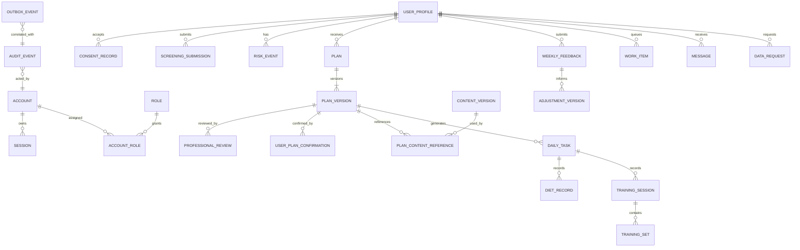

# 练伴封闭测试 MVP 数据库与迁移回滚方案

状态：研发建议，等待产品数据规则冻结
日期：2026-07-23
所有者：研发部

## 1. 边界

本文定义数据结构边界、完整性原则和迁移流程，不定义筛查题、风险阈值、热量/训练规则或调整算法。留存期限和状态边界来自产品基线 v1.1；下列模型仍是逻辑 ERD，不是可执行迁移。

## 2. 逻辑 ERD

## 3. 聚合与约束

| 聚合 | 必要约束 |
| --- | --- |
| 账号 | 登录标识唯一；初始密码状态显式；停用立即使会话失效 |
| 档案/同意 | 同意记录按版本追加；选填字段允许为空；来源和确认时间可追溯 |
| 筛查/风险 | 原始提交不可覆盖；评估结果引用规则版本；风险暂停和恢复均写审计 |
| 计划 | `plan` 标识用户计划序列；`plan_version` 不可变；同用户同日期最多一个 `ACTIVE`，同用户同时最多一个待确认版本 |
| 审核 | 营养、训练分开唯一；决定、审核人角色、资格、时间和所审版本不可缺失；禁止审核自己编制的对应部分 |
| 用户确认 | 饮食、训练分开唯一；拒绝必须引用原因代码；确认只针对精确且未超时版本 |
| 内容 | demo、待审核、批准、停用分离；真人发布事务校验所有引用均可发布 |
| 执行记录 | 日期和任务唯一；训练组使用稳定 ID 和顺序；幂等键防止重复写入 |
| 周调整 | 事实、数据周期、可信度、变更和保持变量归属完整新计划版本，并重走双审核/双确认/生效流程 |
| 待办 | 只保存领域资源引用和处理状态，不复制计划/风险事实 |
| 审计/outbox | 只追加；业务变更、审计和 outbox 同一事务提交 |

产品 v1.1 已冻结确认期限、单一待确认版本、空档、五角色职责和留存期限。风险阈值、暂停影响范围、专业规则和响应 SLA 仍须签字后才能转成检查约束。

计划版本需要显式保存 `effective_at`、`confirmation_deadline_at`、`confirmation_timed_out_at` 和来源类型。`confirmation_deadline_at` 按中国标准时间规则生成并以 UTC 存储。数据库约束与事务锁共同保证每名用户最多一个待确认版本；超时任务必须幂等地终止确认资格。旧版本不得延长 `effective_to`，到期无替代版本时查询结果显式返回空档。

## 4. 数据分类

建议分级：

- `S0` 公开或非敏感配置；
- `S1` 账号与运营元数据；
- `S2` 个人资料、执行记录和消息；
- `S3` 健康筛查、疼痛、恢复、专业审核及自由文本。

`S2/S3` 默认禁止进入普通应用日志、测试夹具和分析导出。具体字段分类、导出范围、脱敏方式和保留期必须由产品/隐私负责人批准。

## 5. Schema 与命名建议

首轮保持一个数据库，使用逻辑 schema 分离：

- `iam`：账号、会话、角色；
- `care`：档案、同意、筛查、风险；
- `planning`：计划、审核、内容引用和调整；
- `execution`：任务、饮食、训练和周反馈；
- `ops`：待办、消息、数据请求、outbox；
- `audit`：追加式审计。

主键使用 UUID；时间统一存 UTC；业务日期同时保存用户时区语义。枚举在应用契约中版本化，数据库使用文本加检查约束，避免数据库原生 enum 阻碍安全扩展。

## 6. 迁移流程

每次迁移必须包含：目的、影响表、锁风险、数据量假设、`up`、开发/测试用 `down`、生产恢复策略和验证查询。

发布顺序：

1. 在临时数据库从零执行全部迁移；
2. 从上一发布版本升级并运行契约/集成测试；
3. 评估锁和执行时间，禁止无界全表更新；
4. staging 备份并执行迁移；
5. 运行 schema、行数、约束和关键状态验证；
6. 创建生产恢复点；
7. 先执行向后兼容的 expand 迁移，再部署应用；
8. 观察稳定后单独执行 contract 清理。

## 7. 回滚原则

- 应用回滚：数据库保持向后兼容时，回滚到上一不可变制品。
- 迁移回滚：仅对未承载真实数据且明确安全的变更运行 `down`。
- 数据变更失败：停止流量，依据迁移日志执行前向修复；需要时恢复到迁移前恢复点。
- 删除/重命名：至少跨两个发布完成，先新增、双写/回填、切读，再删除旧字段。
- 不可逆迁移：必须获得研发负责人批准并完成恢复演练。

生产不得使用 ORM 自动同步 schema，不得在应用启动时隐式执行迁移。

## 8. Seed 与演示隔离

Seed 分为 `reference` 和 `demo`：

- `reference` 只包含无专业含义的状态、角色和原因代码骨架；
- `demo` 使用固定虚构 UUID，全部内容标记 `demoOnly=true`、`DEMO_UNREVIEWED`；
- staging/closed-beta 默认拒绝载入 demo 用户，演示环境使用独立数据库；
- 真实计划发布在数据库事务内再次验证内容批准状态。

## 9. 备份、恢复与删除

恢复演练至少验证：数据库可恢复、审计链连续、计划活动版本唯一、outbox 可重放且不重复、账号会话可统一失效。

产品 v1.1 的首轮生命周期为：可识别用户、健康、执行和原始计划数据在测试结束后 30 天内删除或匿名化；授权记录最小化后保留 12 个月；审计在 30 天内去标识化并保留 12 个月；导出包 7 天删除；备份滚动最长 30 天。删除请求原则上在 7 个自然日内完成核验和说明。实现前仍需隐私/合规复核，并明确未关闭安全事件的最小冻结字段。

## 10. 迁移开工门槛

产品 v1.1 已冻结状态、权限和留存口径，但尚待三方技术映射。专业规则版本字段和 P05/P06 签字、部署/认证参数及开工复核通过前，不创建可执行 schema 或迁移。
